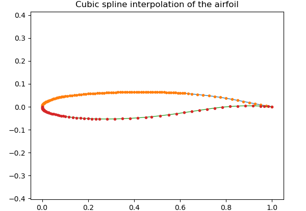
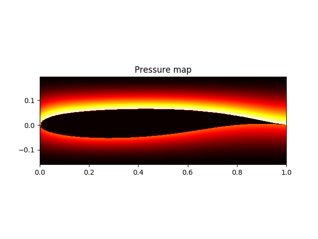
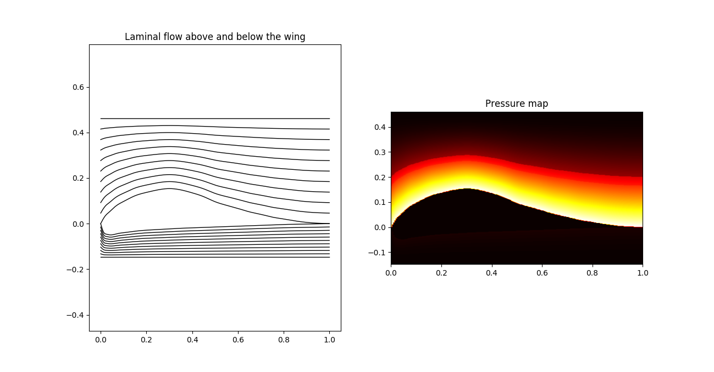

# Interpolation and integration methods / Cubic splines and surface interpolation

## Authors

- Imad Boudroua
- Mohamed Faycal Boullit
- Lucas Guédon
- Enzo Mezzasalma
- Simon Triscos

## Requirements to run the project

- Python
- Numpy
- Matplotlib

## Content of the project

- spline.py:  
Contains the function spline_fun, which creates a spline from an array of points
You can run this file to view the interpolation of the wing of a k1 (NYU/Grumman K-1 transonic airfoil).

- integration.py:  
Contains the function integrate, which integrates a function using either the left rectangle or the midpoint rectangle method.
You can run this file to view efficiency of the different integration functions.

- airflow.py:
Contains the function length, which computes the length of a function using a given integration method.
Contains functions to compute the speed or the pressure of the airflow around a wing.
You can run this file to view the airflow and the pressure map of the k1 wing.

